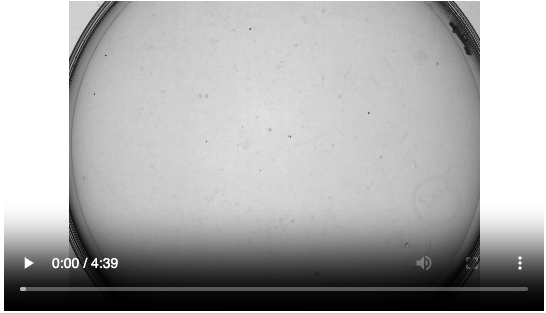

# Tracking worm navigation behavior  in response to odor patches

## Short description 

Worms (_C. elegans_) are placed on an agar plate with odor patchs. The worms are tracked and navigation strategies can be compared in chemotaxis assays for worms with different conditioning histories.

## Name of PI  

[Arantza Barrios](https://profiles.ucl.ac.uk/38261-arantza-barrios)

## Lab website  

https://www.barrioslab.org/

## URL to publication which uses/describes the dataset 

Data here is more recently acquired, but a previous study using this type of data is:

[Molina-García et al. **Conflict during learning reconfigures the neural representation of positive valence and approach behavior**, Current Biology, Volume 34, Issue 23, 2024](https://www.sciencedirect.com/science/article/pii/S0960982224013782)

## Link(s) to dataset/supplementary information  

Read the README.md here to understand the datasets: https://github.com/Barrios-Lab/Chemotaxis-Data-and-Analysis

**Videos** of some of the original recordings can be found here: https://rdr.ucl.ac.uk/articles/dataset/_b_Chemotaxis_Raw_Videos_b_/31390177/1

## Suggestions for easy tasks/low-hanging fruit   

Load in dataset in Jupyter notebook, create plot of trajectory as in paper above (e.g. Figure 4A)

## Suggestions for more involved tasks/further analyses 

Create an interactive display of the worm trajectory as is shown in the videos.

<video width="540" height="310" controls>
  <source src="https://rdr.ucl.ac.uk/ndownloader/files/62091505" type="video/mp4">
</video>

## Is there someone who is happy to be contacted with questions about the paper/dataset (e.g. PhD student/postdoc)? 

Shruti Apurva (shruti.apurva.23 - at - ucl...)